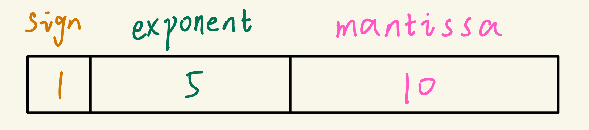
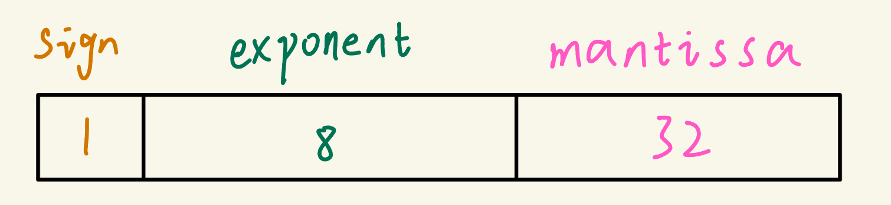
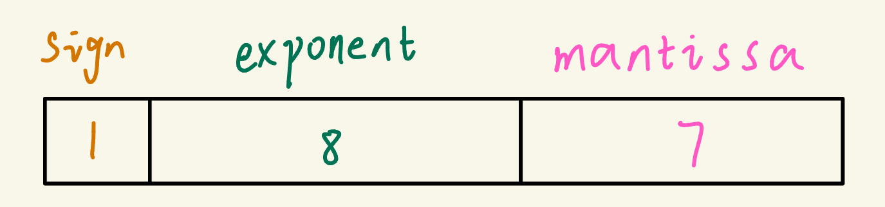
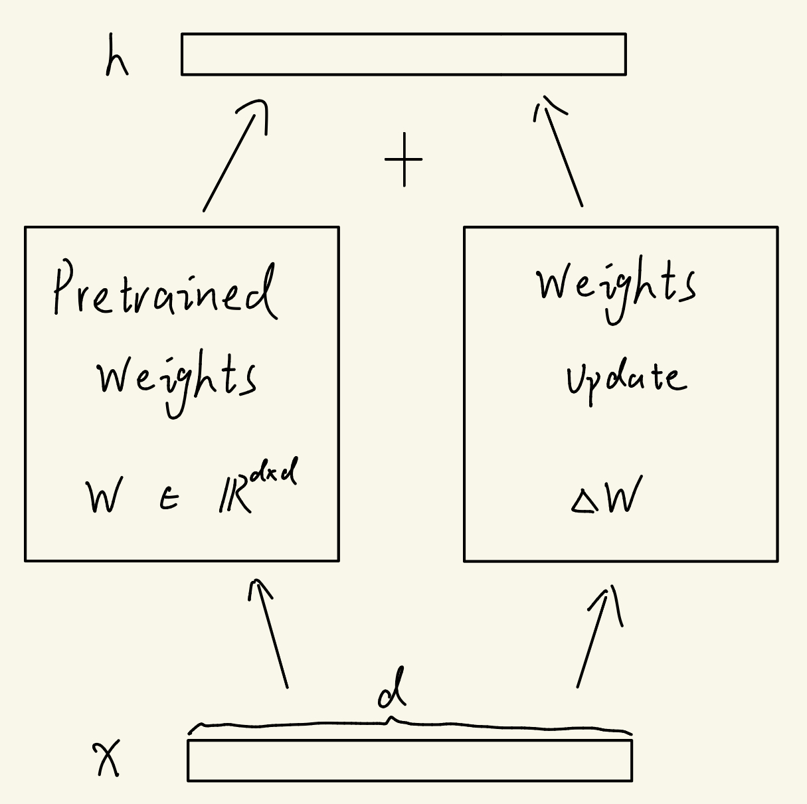
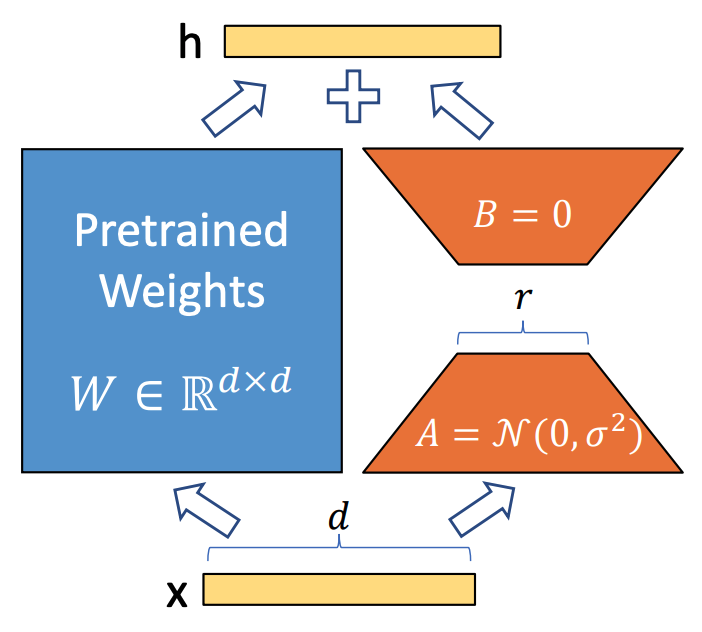

# LLM Fine-Tuning Note

## 1. AMP (Automatic Mixed Precision)

### Definition of Terms

**FP16:** Half Precision Float (16 bits = 2 bytes)

<div style="display:block; max-width:700px; margin:0 auto;">
  <figure style="margin:0; text-align:center;">
    
		<figcaption style="margin-top:6px; font-size:0.95rem; font-weight:600; letter-spacing:.02em; color:#555;">
  		FP16 bit layout: 1-bit sign, 5-bit exponent, 10-bit fraction (mantissa)
		</figcaption>
  </figure>
</div>


An FP16 number can be computed like this.
$$
\begin{equation*}
x_{10} = (-1)^{sign} \times 2^{exp-15} \times (1 + \frac{10\ bits}{2^{10}})
\end{equation*}
$$
Here, \(exp \in \{1,\dots,30\}\) (all-zero and all-one exponent patterns are reserved).


- **Sign bit:** Determines whether the number is positive (0) or negative (1).
- **Exponent bits:** Represent the power of two (scale) with a bias to cover both large and small values.
- **Mantissa bits:** Represent the fractional precision part of the number.


But the maximum of an FP16 number is
$$
\begin{equation*}
x_{max}=2^{30-15} \times (1+\frac{2^{10}-1}{2^{10}}) \approx 65504
\end{equation*}
$$
It is limited to represent values in the training process. So we can consider using **BF16**, which provides a larger dynamic range but sacrifices some precision in the fractional part.

---

**FP32:** Single Precision Float (32 bits = 4 bytes)

**FP32** increases both the dynamic range and precision for representing values, but it requires **twice the storage space** (4 bytes vs. 2 bytes for 16-bit formats).

<div style="display:block; max-width:700px; margin:0 auto;">
  <figure style="margin:0; text-align:center;">
    
		<figcaption style="margin-top:6px; font-size:0.95rem; font-weight:600; letter-spacing:.02em; color:#555;">
  		FP32 bit layout: 1-bit sign, 8-bit exponent, 32-bit fraction (mantissa)
		</figcaption>
  </figure>
</div>


An FP32 number can be computed like this.
$$
\begin{equation*}
x_{10} = (-1)^{sign} \times 2^{exp-127} \times (1 + \frac{32\ bits}{2^{32}})
\end{equation*}
$$

---

**BF16:** Brain Float 16 (16 bits = 2 bytes)

<div style="display:block; max-width:700px; margin:0 auto;">
  <figure style="margin:0; text-align:center;">
    
		<figcaption style="margin-top:6px; font-size:0.95rem; font-weight:600; letter-spacing:.02em; color:#555;">
  		FP16 bit layout: 1-bit sign, 8-bit exponent, 7-bit fraction (mantissa)
		</figcaption>
  </figure>
</div>

An **BF16** number can be computed like this.
$$
\begin{equation*}
x_{10} = (-1)^{sign} \times 2^{exp-127} \times (1 + \frac{7\ bits}{2^{7}})
\end{equation*}
$$
Here, \(exp \in \{1,\dots,254\}\) (all-zero and all-one exponent patterns are reserved).


The maximum of an BF16 number is
$$
\begin{equation*}
x_{max}=2^{254-127} \times (1+\frac{2^{7}-1}{2^{7}}) \approx 3.389531389 \times 10^{38}
\end{equation*}
$$

---

### Commonly used strategy

```text
Forward:  FP16 / BF16  - BF16 recommended for its wider dynamic range
Backward: FP16 / BF16  - BF16 recommended for its wider dynamic range
Optimizer: FP32        - For numerical stability
```


## 2. LoRA (Low-Rank Adaptation)

***LoRA** is used to speed up LLM fine-tuning, allowing small GPU to fine-tune big-scale LLMs.

<div style="display:flex; justify-content:center; gap:12px; height:500px;">
  <figure style="margin:0; text-align:center; width:48%; display:flex; flex-direction:column; height:100%;">
    
    <figcaption style="margin-top:6px; font-size:0.95rem; font-weight:600; letter-spacing:.02em; color:#555;">
      Figure 1: Full Fine-tuning
    </figcaption>
  </figure>
  <figure style="margin:0; text-align:center; width:48%; display:flex; flex-direction:column; height:100%;">
    
    <figcaption style="margin-top:6px; font-size:0.95rem; font-weight:600; letter-spacing:.02em; color:#555;">
      Figure 2: LoRA Fine-tuning
    </figcaption>
  </figure>
</div>


LoRA **reduces the number of trainable parameters** by reparameterizing the update matrix as  

$$
\begin{equation*}
W = W_0 + A B, \quad A \in \mathbb{R}^{d \times r}, \; B \in \mathbb{R}^{r \times d}
\end{equation*}
$$

so the update cost changes from $d \times d$ to $2dr$.


## 3. QLoRA (Quantized LoRA)

QLoRA is a method that combines low-bit quantization (e.g., 4-bit) with LoRA to enable memory-efficient fine-tuning of large language models.
